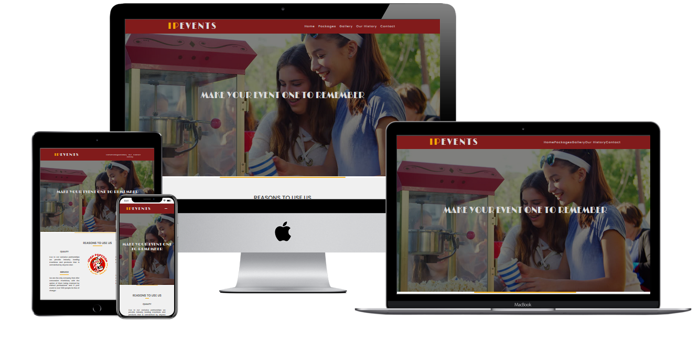
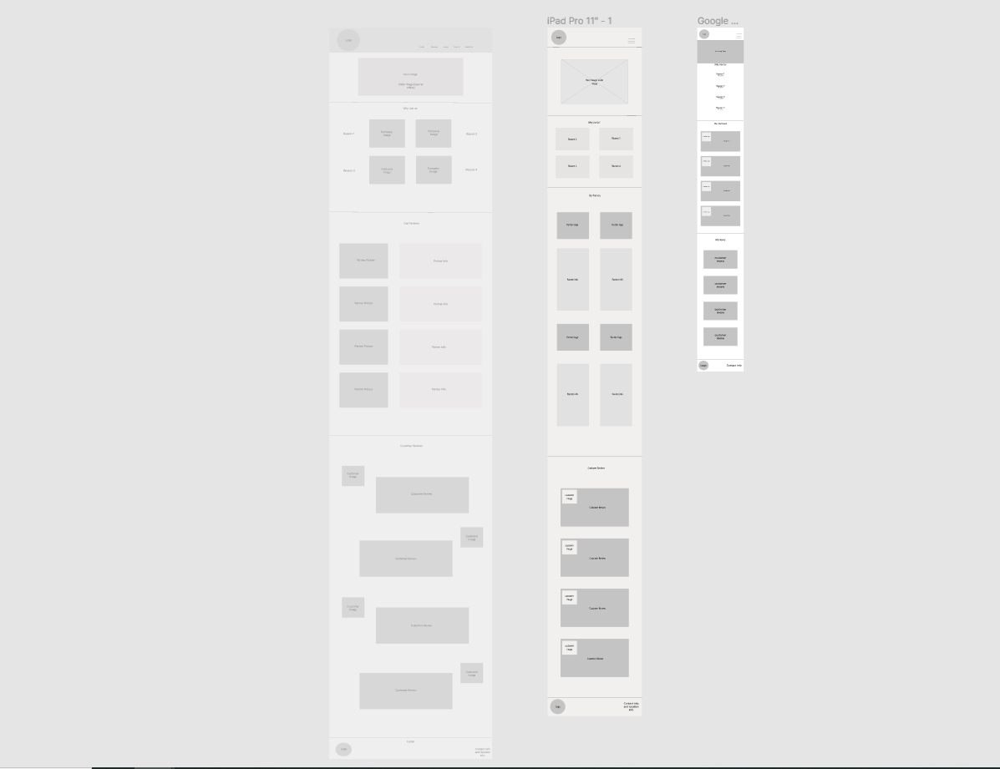
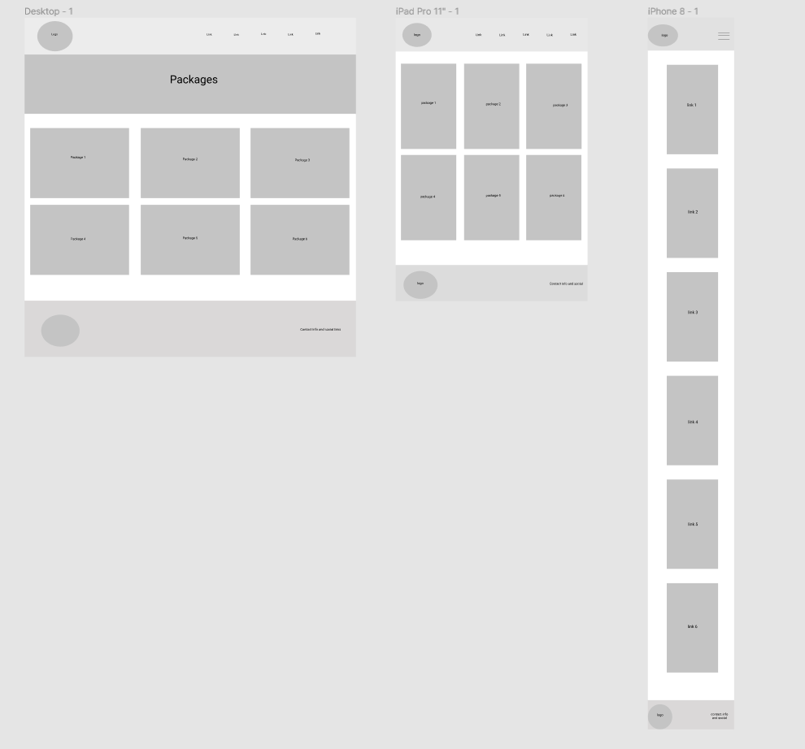
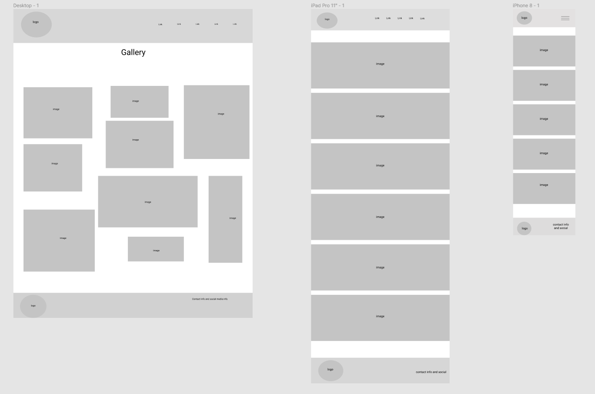
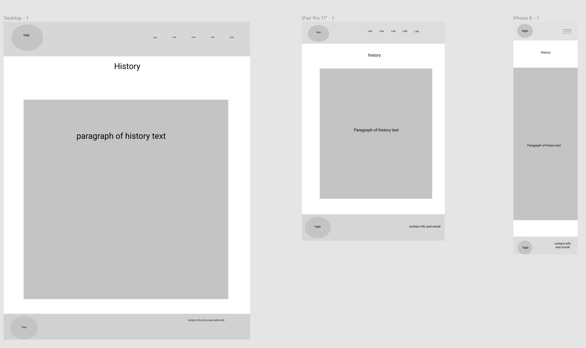
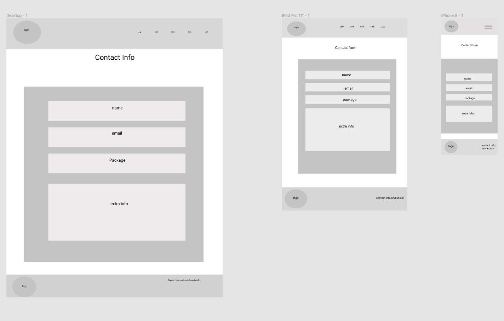

<h1>Irish Popcorn Company Events</h1>

<h2> Code Institute - Milestone Project 1</h2>
 
 

I got the idea to make Irish Popcorn Company Events while i was at work at the real Irish Popcorn Company.
While our business currently does offer event rentals it is not very well advertised nor is it very accessible online.
I thought instead of having a small section on the current website we could split it into its own sub company with its own website
and that this could bring much more attention to our rental/event service and make it a much bigger part of the business.

This project is the first of four Milestone Projects that make up the Full Stack Web Development Program at The Code Institute,
 and the main requirements were to make a responsive and static website with a minimum of 3 pages using HTML5 and CSS3.

 if you want to see the live build of my site [click here](https://killiskey.github.io/milestone-project-1/index.html)<!-- link to live build!-->
 

 <h2>Table of Contents</h2>

# **Table Of Contents**
- [Go to User Experience](#user-experience)
- [Go to Design Process](#design-process)
- [Go to Features](#features)
- [Go to Technologies Used](#technologies-used)
- [Go to Testing](#testing)
- [Go to Deployment](#deployment)
- [Go to Credits](#credits)
- [Go to Acknowledements](#acknowledgments)

# User Experience (UX)
This is the UX section. This is where i focus on who the website is for, what the website does 
and how the website can give the user what they are looking for.

<h3>Project Goals:</h3>
<ul>
<li>To provide a website that makes it possible for a user to hire out popcorn, candyfloss, slush and nacho machines for corporate or private parties.</li>
<li>To make it quick and easy for a customer to learn about and book their own private package</li>
<li>To present detailed information about the rental packages and what they include </li>
<li>To be able to contact Irish Popcorn Company Events with any quiries wuick and easy.</li>
<li>to provide a way to pick and tailor a personal rental package and means to arrange a booking.</li>
<li>To create a fully responsive website that works on desktop/laptop, tablet and mobile</li>
<li>To increase awareness about the Irish Popcorn Company's Rental/event services by developing a profeessional website dedicated to it.</li>
</ul>

## User Stories:

### New User:

* I am a user that is new to hiring out Snack food equipment i want to know why it is worth my time hiring our these machines for my private fuction.</li>
* I want to know what the Irish Popcorn Company Events offers that sets them apart from other rental companies</li>
* I want to be able to tailor my own rental package and have a way to organise a booking for a specific date.</li>

### Returning User:

* I am a returning user who has already booked with the company in the past, i want to post pictures of my event and find out if i get any discount for hiring again.</li>

### Business Owner:

* I am the business owner i want to see the business grow and succeed, i want to display all information about renting our machines in a clear and attractive way.
i also want users to be able to quickly and easily contact our company with questions or to arrange a booking

# Design Process:

### Strategy Plane:
The main goal of the website is to attract users who are looking to hire concession machinery and equipment to give their private function a bit more flair.
The website is aimed at both domestic and corporate users with packages available to cater for all sizes. It should include imagery of the machines available the products that come with the machines and also past events that have used our services.
I started the UX process by thinking about what i would like to see if i was looking to hire out concession equipment for my own event.

### Scope Plane:
The main features on the website are based around what the user needs, i want the user to be able to

* pick a rental package that caters for their needs
* easily get in contact either to book or ask any questions they might have
* See images of past events the company have done so they get a better idea of what we can do
* navigate the site quick and easy
* have the option of accessing the companies social media
* Learn about the history of the compamy and what its about

### Structure plane:
This is where i thought about the overall layout and navigation of the website
After the homepage my second most important page is my packages page so i decided to layout the navigation starting in that order.
I split my features into 5 main pages and laid them out in the order of importance Home, Packages, Gallery, History, Contact
i wanted to have a bit of consistency accross #my pages so i decided to have a title on the top of each page before the main Content
this keeps each page looking similar, i thought about giving each page the same layout but i decided against it as the content between pages are so different i didnt want to be 
restricted by the one page design.

### Skeleton Plane:
This stage is when i put together my wireframes which i used Figma to create.
I created a wireframe for each page on desktop/laptop tablet and mobile.

i wanted the user to be presented with a simple clean nav bar with 5 choices,
Home, Packages, Gallery, History, Contact.

on the home page the user is greeted with a hero image then below follows reasons to use us , a list of our partners and some customer reviews.
On the Packages page the user is instantly able to see all the rental packages and what they include, each package will have a link to contact form.
On the Gallery page i will have a large gallery of past events so the user can have an idea of what to expect.
on the history page i will have a brief history of the company and what it stands for so the user can understand the company and get to know us a little better.
On the Contact page the user is presented with a clean simple contact form to get in touch about bookings or questions.

During the construction of the wireframes i debated whether to include some of the gallery on the home page with a link to take you to the main gallery page.
I thought the gallery would help the user make a decision on whether to book a rental with us so it might be good to include upfront.
In the end i decided against it as i thought customer reviews would be a better fit to the overall design of the homepage, i also didnt want to overlap too much content between pages.

I have included screenshots of the wireframes below and the full wireframes can be viewed on [Figma](https://www.figma.com/file/7sULYs3D2Oz9Hm1Fo0acZ9/Milestone-Project-Wireframe?node-id=0%3A1)

### Surface Plane:

This section is when i focused on the design of my site.

Colours: Since IPEvents is a devision of Irish Popcorn And Snackfood Company i decided to keep the colour scheme generally inline with the colours of Irish Popcorn.
While i decided to use the theme of Irish Popcorns red and gold i changed shades and added some colours along the way to make sure this site has its own identity.
I decided to use #f1a602 and rgb(129, 27, 27) as my dominant red and gold colours and then used #dadada #383838 as my accent and font colours.

Fonts: As the parent company Irish Popcorn and Snackfood Company supply cinemas with all their concession i thought it would be a great idea to bring that into the rental site by 
using an Art Deco style font for the headers and logo. I found Limelight on google fonts and thought it was the perfect font to achieve this look.
i then used Poppins for my main text and navbar options and i thought it was clear and easy to read giving a good contrast to Limelight while also giving a lighthearted feel which i thought is important 
as the main focus of this site is around parties and events.

Images: I was able to get my images of machines and logos from Irish Popcorn Comapnies Database
although i did use google images for the past events pictures in the gallery.

Layout: I wanted to create a slight contrast between different areas of content on my homepage so i used a light grey colour of #dadada for the backgrounf of some sections and then left others white.
i decided to keep the navbar and footer the same colour of red with light grey writing and then have gold accents throughout keeping my colour scheme consistant across each page.
i decided to give any button or link a gold highlight on hover to tie in with the theme.

### Features:

The project consists of 5 main pages which can be accessed through the main navbar or the footer.

#### Consistent Features

* navbar and footer are the same design and colour across each page
* The Navbar will shrink and become a burger icon when viewed on mobile devices

#### Home Features

* Reasons to use us - This section gives the user the main reasons and benefits to use this site over its competitors.
* Partners - This section goes through all of the sites partners and gives some detail no them letting the user know what kind of quality machinery to expect
* Reviews - This section lets the user see some reviews from past customers. This section should encourage the user to book with us 

#### Packages Features 

* Intro banner - Short introductory banner at the top of the page with the company slogan.
* Rental Packages - this section gives the user all the info they need on what each package includes along with some images of the machinery included.
there is also a button included that takes the user directly to a contact form so they can enquire or ask a question.

#### Gallery

* Intro banner - Short introductory banner at the top of the page with a description of what images you can see on the page
* Image gallery - this section lets the user see a group of images form past customer events. This should let the user see what we can add to their event and convince them to use us over competitors.

#### History

* Jumbotron - this section lets the user know what they are going see below
* History - this section gives the user view into the history of the company, what it stands for and where it came from

#### Contact

* Intro banner - Short introductory banner at the top of the page
* contact form - this section lets the user fill out a contact form to wither enquire about a booking or just get in touch with any questions they may have.

### Features i might add in future:

* I would consider adding the ability to book an event straight from the website this could streamline the entire business and increase bookings
* I would love to add a section where the user could leave their own review and hav a more indept review section
* Adding a page full of instructional videos on how to use each machine would be helpful incase a customer had a problem with a hired machine.
* it would be good to add the option to sign up to a newletter so users could know about news packages etc..
* i would like to add an option for the user to add their own images of their events to help build up the gallery

### Technologies Used:
#### Languages, libraries, frameworks, editors and version control

* HTML5<dd>The language used to create the form and add content to the website.</dd>
* CSS3 <dd>Language used to style the HTML5</dd>
* Javascript<dd>I used this to code the burger nav button/slide out navbar</dd>
* Boostrap framework <dd>I used Bootstrap's grid system in order to have a 'mobile'-first' approach</dd>
* Gitpod<dd>I used Gitpod's development environment to write the code for the website</dd>
* Git Version Control<dd>I used Git for Version Control to record changes and updates to my files</dd>
* Github<dd>I used GitHub’s repository hosting service to host my deployed website as well as track previous versions of my code</dd>

#### Other Tools Used

* Figma<dd>I used Figma to design wireframes for my website for Laptop/Desktop, mobiles and tablets.</dd>
* Google images<dd>I used Google Images to get images for the gallery and hero images</dd>
* Google Fonts<dd>i used google fonts to get Limelight and Poppins to be used as my main fonts. I also used sans serif as a fallback font</dd>
* Font Awesome<dd>I Used this for my social icons in the footer</dd>

#### Educational Resources Used

* W3 Schools<dd> i used this for minor help on some parts of my project like the contact form</dd>
* Md Bootstrap.com<dd>i used this for the review section of my project</dd>
* Youtube<dd>i used this for help on my burger navbar (credit to DevEd for the tutorial)</dd>
* Stack Overflow<dd> i used this to help out on minor things i got stuck on like getting a picture to line up correctly</dd>

### Testing User stories:

* *I am a user that is new to hiring out Snack food equipment i want to know why it is worth my time hiring our these machines for my private fuction.*
on the homepage the user is met with a navbar containing links to all 5 pages **Home, Packages, Gallery, History, Contact**
they are then met with a hero image showing one of our machines at an event being enjoyed.
they can see the benefits of using us. They can then see below great reviews from past customers 
*  *I want to know what the Irish Popcorn Company Events offers that sets them apart from other rental companies*
This user can navigate to the partner section that displays the companies that our site is partnered with, 
This ensures the user that the quality of machinery we offer is unmatched by any other company on the market. 

* *I want to be able to tailor my own rental package and have a way to organise a booking for a specific date.*
This user can navigate to the packages page and read the create your own packages option,
which explains what options they have to choose from. they will then be brought to the contact form where they can fill out what specifics they want.

#### Returning user
 * *I am a returning user who has already booked with the company in the past, i want to post pictures of my event and find out if i get any discount for hiring again.*
This User can send pictures through the email link provided in the gallery section, they can also see that in the packages section it is explained returning customers get a discount

#### Business Owner

* *I am the business owner i want to see the business grow and succeed, i want to display all information about renting our machines in a clear and attractive way.
i also want users to be able to quickly and easily contact our company with questions or to arrange a booking.*
The owner would see that there is a consistent design across the website, with lots of imagery making the site attractive
information about each package is clearly displayed in the packages section and customers can get in touch through the contact form.

### Validating the code:

I validated both **HTML** and **CSS** with [W3C Markup Validation Service](https://validator.w3.org/)</a>

### Validation Results:
**HTML**
* Home - no errors found
* Packages - no errors found
* Gallery - no errors found
* History - no errors found
* Contact - no errors found

**CSS3**
* No errors Found

## Testing

### Testing on different browsers:

I manually tested the website on the following browsers:

* Chrome
* Mozilla Firefox
* Safari
* Edge

### Testing responsiveness on multiple devices and screen sizes:

I manually tested the website by using Google Developer Tools to check each individual page and the website as a whole worked on different devices and different screen sizes,
including: Moto G4, Galaxy S5, Pixel 2, Pixel 2 XL, iPhone 5 SE, iiPhone X, iPad,Phone 6/7/8, iPhone 6/7/8 Plus,  iPad Pro. 
I also manually tested the site on my Pc/Laptop, Samsung tab s6, and Pixel 3.

### Issues Found:
* The first issue i encounted was after i created my Nav bar. Since i created my navbar without using bootstrap i had some minor problems when i then included bootstrap after this
i found that bootstrap would overide the positions i had my logo and links placed i had to insert a margin: 0 into each one to fix this problem.

* i had an issue with content on pages overlapping my footer so i created a custom spacer div for each 
page to give them a nice amount of room between content and footer.
* I orginally decided to put a logo picture in the navbar but when resizing it seemed to get too small and look off, i decided 
to replace it with a text logo instead as i found that looked alot better.
* After i made my form responsive i noticed the divs that seperated didnt align properly even though the form scaled with the page correctly
to fix this i needed to change the border radius on the divs in a media query 
i changed
<dd>.col-md-3 {
  background: rgb(129, 27, 27);
  padding: 4%;
  border-top-left-radius: 0.5rem;
  border-bottom-left-radius: 0.5rem;
}

.col-md-9 {
  background: #f1a602;
  padding: 3%;
  border-top-right-radius: 0.5rem;
  border-bottom-right-radius: 0.5rem;
}</dd>
 
<dd>To</dd>
 
<dd> .col-md-3 {
    border-top-right-radius: 0.5rem;
    border-bottom-left-radius: 0;
  }

  .col-md-9 {
    width: 100%;
    border-top-right-radius: 0;
    border-bottom-left-radius: 0.5rem;
  }</dd>

### Deployment

I took the following steps to deploy IPEvents to Github pages.
- Searched GitHub in my internet browser and signed into my GitHub account.
- Clicked on [My Repositories.](https://github.com/Killiskey?tab=repositories)
- Navigated to [milestone-project-1.](https://github.com/Killiskey/milestone-project-1)
- Selected [Settings.](https://github.com/Killiskey/milestone-project-1/settings)
- Scrolled down to the section called GitHub Pages.
- Selected 'Master Branch' from the 'source' dropdown menu.
- Confirmed my selection by clicking on save.

### Credits:

* The only code i directly copied for this site was for the Review and gallery section 
i got the code for the review section from [mdbootstrap.com](https://mdbootstrap.com/docs/jquery/sections/testimonials/)
and i got the code for the gallery section from [w3schools.com](https://www.w3schools.com/howto/howto_css_image_grid_responsive.asp)

* I used a youtube video for for help creating my burger nav bar as i needed to use some javascript 
you can see the tutorial here from [DevEd](https://www.youtube.com/watch?v=gXkqy0b4M5g&t=143s) 

* i used [w3schools](https://www.w3schools.com/bootstrap/bootstrap_forms.asp) for help with my responsive contact form 

#### content
The contents of this website are mostly fictional and have been made up by myself.
i got alot of the images from a personal source except for some in the gallery i got from google images.
i also used Anna greaves [video](https://www.youtube.com/watch?v=7BteidgLAyM&feature=youtu.be) to help mw with the README.md file
 
#### media
All image links taken from google images can be found below

* [Popcorn Package](https://www.google.ie/url?sa=i&url=https%3A%2F%2Fwww.miscw.com%2Flets-boycott-popcorn-malls-waste-hard-earned-money-8562.html&psig=AOvVaw1vkTRgC4Rum7WSInJQDIXU&ust=1605642088755000&source=images&cd=vfe&ved=0CAIQjRxqFwoTCPCukovph-0CFQAAAAAdAAAAABAI)
* [Ice-Cream Package](https://www.google.ie/url?sa=i&url=https%3A%2F%2Fross-companies.com%2Fstay-cool-with-these-sweet-treats-silver-spring-apartment%2F&psig=AOvVaw2CIdu4fY7oXG42FFvlMZX8&ust=1605642948754000&source=images&cd=vfe&ved=0CAIQjRxqFwoTCJjBpNrvh-0CFQAAAAAdAAAAABAD)
* [Slush Package](https://www.google.ie/url?sa=i&url=https%3A%2F%2Fwww.mywebtimes.com%2Farticles%2Ftn%2F2017%2F07%2F18%2F6a33f938d3705ae089a87b17a1644d26%2Findex.xml&psig=AOvVaw2UHmEHqeG7u-32XTNkVorJ&ust=1605643795935000&source=images&cd=vfe&ved=0CAIQjRxqFwoTCPCf4LTvh-0CFQAAAAAdAAAAABAD)
* [Candyfloss Package](https://www.google.ie/url?sa=i&url=https%3A%2F%2Fwww.westend61.de%2Fen%2FimageView%2FGD001081%2Fyoung-woman-eating-candy-floss-at-a-fun-fair&psig=AOvVaw2-LDd06Cuww6iLEKpaBK7j&ust=1605640947412000&source=images&cd=vfe&ved=0CAIQjRxqFwoTCNDc-sToh-0CFQAAAAAdAAAAABAD)
* [Nacho Package](https://www.google.ie/url?sa=i&url=https%3A%2F%2Fmyfoodstory.com%2Fno-brainer-loaded-nachos-platter-recipe%2F&psig=AOvVaw1rfU9A-e5JGAmeNq7EgYgx&ust=1605640386290000&source=images&cd=vfe&ved=0CAIQjRxqFwoTCMjdtNvih-0CFQAAAAAdAAAAABAD)
* [Create Package](https://www.google.ie/url?sa=i&url=https%3A%2F%2Fmyfoodstory.com%2Fno-brainer-loaded-nachos-platter-recipe%2F&psig=AOvVaw1rfU9A-e5JGAmeNq7EgYgx&ust=1605640386290000&source=images&cd=vfe&ved=0CAIQjRxqFwoTCMjdtNvih-0CFQAAAAAdAAAAABAD)
* [gallery 1](https://www.google.com/url?sa=i&url=https%3A%2F%2Fwww.pinterest.cl%2Fpin%2F206039751676833285%2F&psig=AOvVaw3vfzzmbDf0X2eUyO8xPe1Q&ust=1605707508494000&source=images&cd=vfe&ved=0CAIQjRxqFwoTCMD7juDcie0CFQAAAAAdAAAAABBZ)
* [gallery 2](https://www.google.com/url?sa=i&url=https%3A%2F%2Fwww.pinterest.com%2Fpin%2F392587292497024300%2F&psig=AOvVaw3vfzzmbDf0X2eUyO8xPe1Q&ust=1605707508494000&source=images&cd=vfe&ved=0CAIQjRxqFwoTCMD7juDcie0CFQAAAAAdAAAAABBF)
* [gallery 3](https://www.google.com/url?sa=i&url=https%3A%2F%2Fwww.jmentertainment.co.uk%2Fcategory%2Fpopcorn-machine-hire%2F589%2Fpopcorn-cart-hire&psig=AOvVaw3vfzzmbDf0X2eUyO8xPe1Q&ust=1605707508494000&source=images&cd=vfe&ved=0CAIQjRxqFwoTCMD7juDcie0CFQAAAAAdAAAAABAh)
* [gallery 4](https://www.google.com/url?sa=i&url=https%3A%2F%2Factionevents.com%2Fproduct%2Fcarnival-food-carts%2F&psig=AOvVaw3vfzzmbDf0X2eUyO8xPe1Q&ust=1605707508494000&source=images&cd=vfe&ved=0CAIQjRxqGAoTCMD7juDcie0CFQAAAAAdAAAAABCIAQ)
* [gallery 5](https://www.google.com/url?sa=i&url=https%3A%2F%2Fwww.pinterest.com%2Fpin%2F565624034435586354%2F&psig=AOvVaw37I_M_ms0yXSRkdcZ9O5Pj&ust=1605707836531000&source=images&cd=vfe&ved=0CAIQjRxqFwoTCLC6gPzdie0CFQAAAAAdAAAAABA4)
* [gallery 6](https://www.google.com/url?sa=i&url=https%3A%2F%2Fwww.pinterest.co.uk%2Fpin%2F418623727845096287%2F&psig=AOvVaw37I_M_ms0yXSRkdcZ9O5Pj&ust=1605707836531000&source=images&cd=vfe&ved=0CAIQjRxqFwoTCLC6gPzdie0CFQAAAAAdAAAAABAv) 
* [gallery 7](https://www.google.com/url?sa=i&url=https%3A%2F%2Fwww.xtreme-events.eu%2Fmodule%2Ffunfood-en%2Fnachos%2F&psig=AOvVaw1JL6DD9nXfJw-Sc38eXGg-&ust=1605707948524000&source=images&cd=vfe&ved=0CAIQjRxqFwoTCJja07Heie0CFQAAAAAdAAAAABAV) 
* [gallery 8](https://www.google.com/url?sa=i&url=https%3A%2F%2Fwww.funfoods.ie%2Fproduct%2Flarge-ice-cream-machine-hire%2F&psig=AOvVaw2D3_fD9hIFNmeALe9mAaQr&ust=1605708261921000&source=images&cd=vfe&ved=0CAIQjRxqFwoTCIi1pMffie0CFQAAAAAdAAAAABAH)
* [gallery 9](https://www.google.com/url?sa=i&url=https%3A%2F%2Fwww.xtreme-events.eu%2Fmodule%2Fbeach-party-en%2Fslush-ice%2F&psig=AOvVaw3cZj2paRJGXf9osplUkV7O&ust=1605708305723000&source=images&cd=vfe&ved=0CAIQjRxqFwoTCKj2sNvfie0CFQAAAAAdAAAAABAu) 
* [gallery 10](https://www.google.com/url?sa=i&url=https%3A%2F%2Fwww.disneyfoodblog.com%2F2019%2F04%2F22%2Fnews-and-review-ramones-serv-ice-station-brings-new-frozen-treats-to-cars-land-in-disney-california-adventure%2F&psig=AOvVaw3cZj2paRJGXf9osplUkV7O&ust=1605708305723000&source=images&cd=vfe&ved=0CAIQjRxqFwoTCKj2sNvfie0CFQAAAAAdAAAAABA0)
* [gallery 11](https://www.google.com/url?sa=i&url=https%3A%2F%2Ffuntasiaentertainment.co.uk%2Ffuntasia-products%2FPopcorn-and-Candyfloss-Stall-Hire&psig=AOvVaw3PL8RroXkC2_keXu-8_yYI&ust=1605708795029000&source=images&cd=vfe&ved=0CAIQjRxqFwoTCLDV-8Thie0CFQAAAAAdAAAAABAF)
* [gallery 12](https://www.google.com/url?sa=i&url=https%3A%2F%2Fwww.fundayltd.com%2Fcategory%2Ffood%2F156%2Fpopcorn-cart-hire-victorian-cart-hire&psig=AOvVaw3PL8RroXkC2_keXu-8_yYI&ust=1605708795029000&source=images&cd=vfe&ved=0CAIQjRxqFwoTCLDV-8Thie0CFQAAAAAdAAAAABAu)
* [gallery 13](https://www.google.com/url?sa=i&url=https%3A%2F%2Fwww.fun4events.co.uk%2Ffun-food-for-events%2F&psig=AOvVaw3JC0ecgoXHd87LvuWqlXYM&ust=1605708937641000&source=images&cd=vfe&ved=0CAIQjRxqFwoTCPDzioniie0CFQAAAAAdAAAAABAR) 
* [gallery 14](https://www.google.com/url?sa=i&url=https%3A%2F%2Fwww.skys-entertainment.com%2Fcategory%2Fpopcorn-and-candy-floss-carts%2F150%2Fcandy-floss-and-popcorn-stall-with-attendant&psig=AOvVaw3Fgh8e3a_qvsKTpZ4wkPdY&ust=1605716612720000&source=images&cd=vfe&ved=0CAIQjRxqFwoTCMjt39T-ie0CFQAAAAAdAAAAABBY)
* [gallery 15](https://www.google.com/url?sa=i&url=https%3A%2F%2Ffancyatreat.co.uk%2Fpopcorn-cart-hire-london%2F&psig=AOvVaw3Fgh8e3a_qvsKTpZ4wkPdY&ust=1605716612720000&source=images&cd=vfe&ved=0CAIQjRxqFwoTCMjt39T-ie0CFQAAAAAdAAAAABAv)

### Acknowledgements:
Thanks to my mentor Mark Railton for his useful suggestions and time.